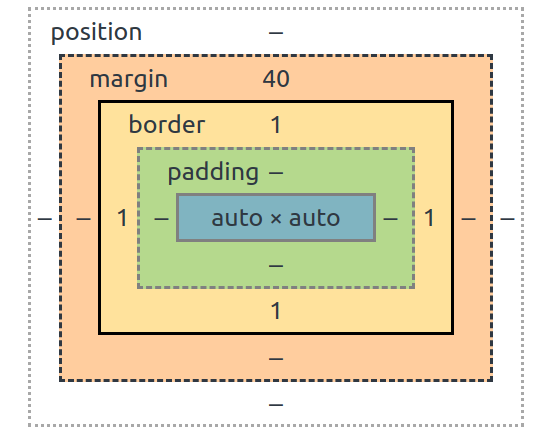
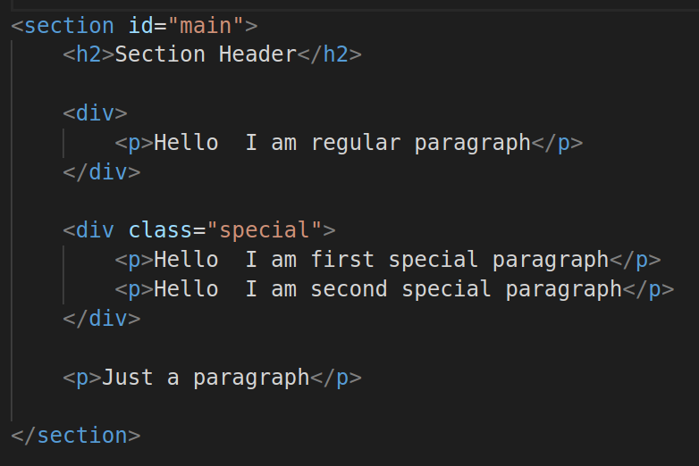
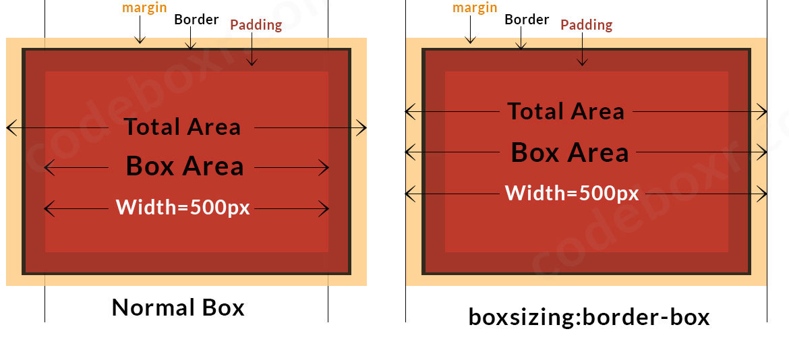
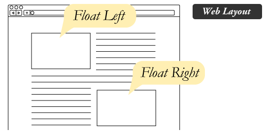

# [CSS](https://www.w3schools.com/w3css/) 

#### CSS Box Model & Structure
```css 
selector {
    property : value
}
```


Class Selector 
```css 
.special {
   text-transform:uppercase; 
}
```
ID Selector
```css
#main {
   background-color: red;
   color:white;
}
```
Element Selector
```css
p { 
    background: blue;
}
```
Combo Selector
```css 
#main p {}
#main div.special p {}
```
Pseudo Class Selector 
```css
div.special:hover { 
	background:blue 
}
```


#### Pseudo Classes, Pseudo Elements
* :active
* :focus
* :disable
* :checked
* :first-child
* :nth-child(n)
* :last-child
* ::after
* ::before


#### Display types

`display:none`  script, style, title etc  
`display:table` flex/grid  
**Inline elements** – no width, height, top/bottom padding, top/bottom margin
a, span, img, strong  
**Inline-block** - button, input  
#### Positioning

#### z-index

The z-index property specifies the stack order of an element. 
An element with greater stack order is always in front of an element with a lower stack order. 
> z-index only works on positioned elements
#### Box Sizing

#### CSS Float

#### CSS Specificity
|Example 1 | Example 2 |  
|--- |--- |  
|||

#### CSS3
Modules include:

**borders** (border-radius, box-shadow)
**backgrounds** (multiple backgrounds)
**box-shadow**
**text-shadow**
**color** (HSL colors, HSLA colors, opacity, RGBA colors)

Also:
* media queries
* multi-column layout
* Web fonts
#### Responsive Design

#### [Media Query](https://www.w3schools.com/css/css_rwd_mediaqueries.asp)
```CSS
@media only screen and (max-width: 600px) {
  body {
    background-color: lightblue;
  }
}
```