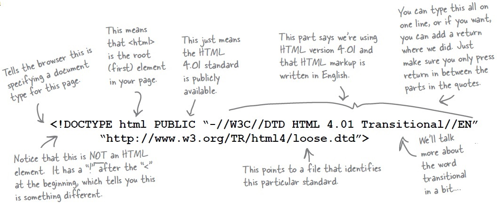
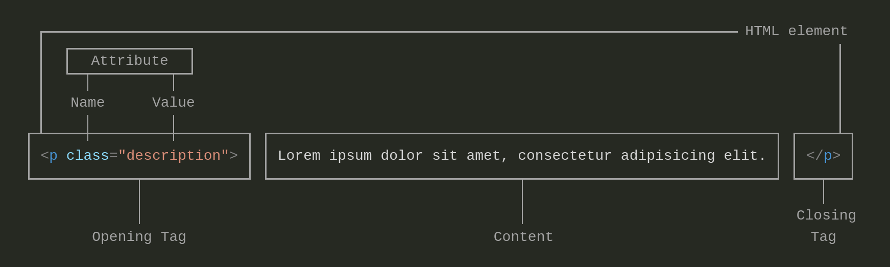
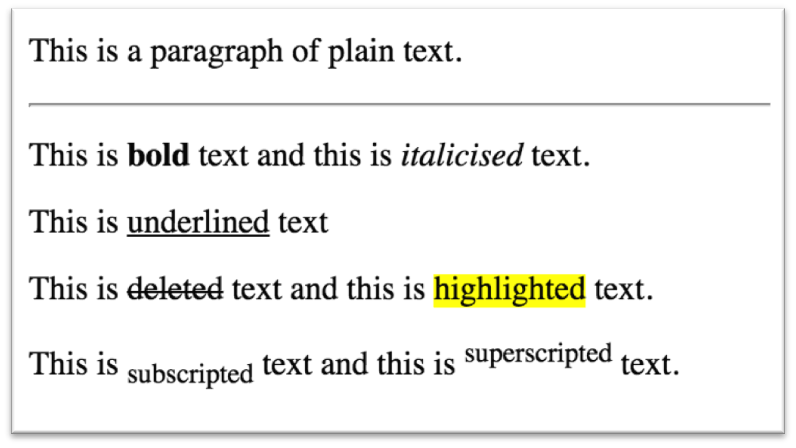
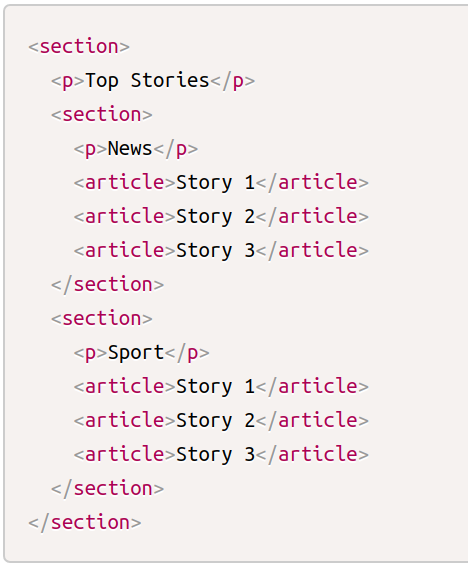
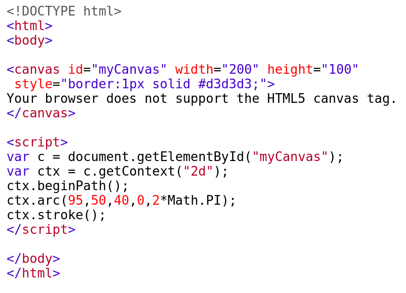
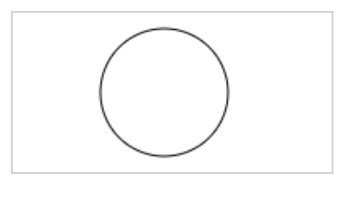

# HTML
HTML describes the structure of web pages using markup with elements as the basic building blocks of HTML pages.

```html
<!DOCTYPE html>	-------------------------------------------------------------------	Doctype declaration
<html>	---------------------------------------------------------------------------------	Root element
     <head>	---------------------------------------------------------------------------------	Header section/meta info
         <title>Title of page</title> 
         <meta charset="UTF-8">
         <meta name=”description” content=”blah blah blah”/>	-------------------------	For SEO
         <meta name="keywords" content="HTML,CSS,JavaScript">
         <meta name="author" content="John Doe">
         <meta name="viewport" content="width=device-width, initial-scale=1.0">---	for responsiveness
         <link rel="icon" type="image/png" href="/favicon.png"/>	------------	favicon
         <link rel=”stylesheet” href=”../css/abc.css”/>	--------------------------	Importing External CSS
     </head>
 
     <body>	---------------------------------------------------------------------------------`	Content
        <p>This text is bold</p>
        <script src=”../abc/script.js”></script>	---------------------------------------	Importing JS file in the end
     </body> 
</html>
```
***
### Who maintains HTML Standards?

- The World Wide Web Consortium (W3C) is the main international standards organization for the World Wide Web. Founded in 1994.
- W3C vs WHATWG! Later WHATWG was founded by individuals of Apple, Mozilla and Opera, then major browser vendors, in 2004, after a W3C workshop. They were becoming increasingly concerned about the W3C’s direction with XHTML and lack of interest in HTML, and disregard for the needs of real-world web developers. And the Web Hypertext Application Technology Working Group was born and they started to work on a separate standard for the new HTML 5. Google & Microsoft joined in later.
- Now, W3C and WHATWG work together on HTML and DOM, in the WHATWG repositories, to produce a Living Standard and Recommendation/Drafts.
- [WHATWG](https://medium.com/swlh/w3c-whatwg-standards-437b375cb793)  maintains the HTML and DOM Living Standards
---
### Why XHTML Failed?
- With the noted exceptions of most HTML browsers having built in support for SVG, Canvas, and MathML. The confidence of built in support for emerging protocols and interfaces trumped the browser game.
- XHTML processed JavaScript differently than the way a browser parser was configured to process.
- And CSS processing?  XHTML requires a very specific CSS syntax to be properly processed in a browser.  Make the smallest mistake and the document renders dead on delivery.
- The advantages of XML are many, including namespaces, faster parsing, smaller and more mobile friendly, but Strict parsing requirements for XHTML resulting in aborted, dead documents more often.
---
### Why DOCTYPE declaration?
- If browser can’t determine the type of document, it switches to quirks mode.
- This means, with the changes in layout mode, it also switches off most of the browser features that have been invented since IE5, and browser attempts to render code based on a ‘best-guess’ basis.
- HTML 4 
```html 
 <!DOCTYPE HTML PUBLIC "-//W3C//DTD HTML 4.01 Frameset//EN" "http://www.w3.org/TR/html4/frameset.dtd">
```
- HTML 5 -
```html
 <!DOCTYPE html>
 ```
 
 ---
 
 - Container Elements
```html
<p></p>,<div></div>
```
- Empty Elements		
```html
<br>, <hr/>, 
```
- No closing tag needed for empty elements, but still its recommended to add / at the end of the opening tag.

### Attributes

#### Global Attributes
- contenteditable          `<p contenteditable="true">Edit this content</p>`
- class
- id
- title                             `<div title="This is tooltip">Hover me for tooltip</div>`
- style                            `<span style="background: #ffe7e8;"></span>`
- tabindex                      `<input type="text" tabindex="2">`
- draggable                    `<div draggable=true>Drag me</div>`
#### Other important attributes

- lang                            `<html lang="en-US">`
- alt                              ``

#### [Event attributes](https://www.w3schools.com/tags/ref_eventattributes.asp)
* onclick
* onmouseover
* onresize
* onchange
* onblur
* onkeydown
* ondragstart
* ondrop
#### Lists and Menus

* Using UL for menu
    - Putting things in a UL element is a semantic way of saying the elements children ( <li> ) are list items and therefore a logical group. Which gives the chunk of html more structure/meaning than just a bunch of div tags. And even unstyled browser can display it logically.

#### HTML Formatting tags
* `<strong>` is used for bold (strong) text / `<b>`
* `<em>` is used for italicised (emphasised) text / `<i>`
* `<u>` is used for underlined text
* `<del>` is used for deleted text
* `<sub>` is used for subscripted text
* `<sup>` is used for superscripted text
* `<mark>` is used for marked/highlighted text
* `<hr>` is used for a horizontal rule (line) as seen below
* `<br>` is for new line


#### User Agent Stylesheet
User Agent will have a default style sheet that presents documents in a reasonable manner. 
> User Agent will have a default style sheet that presents documents in a reasonable manner. 
  “User agents must apply a default style sheet (or behave as if they did)” and that “a user agent’s default style sheet should present the elements of the document language in ways that satisfy general presentation expectations for the document language.”

#### HTML4 vs HTML5


# HTML5
* New semantic elements
  - `<header>, <footer>, <article>, <section>, <aside>` etc.
* New attributes of form elements
  - number, date, time, calendar, and range.
* New graphic elements
  - `<svg> and <canvas>`
* New multimedia elements 
  - `<audio> and <video>`
* New APIs
  - Geolocation, Drag and Drop, Local Storage etc

> Lots of Semantic elements But why?

`<article>, <aside>, <details>, <figcaption>, <figure>, <footer>, <header>, <main>, <mark>, <nav>, <section>, <summary>, <time>`
## [Greater accessibility](https://www.freecodecamp.org/news/semantic-html5-elements/)
   For search engines and assistive tools, the use of section, article, nav, header, footer etc helps to index correct page contents, optimize the page (eg when the network is slow), read the content appropriately for the people with vision problem etc

# `<section>, <article>, <aside>`
* An `<article>` is intended to be independently distributable or reusable.
* A `<section>` is a thematic grouping of content.
* The `<aside>` is for content that is not part of the flow of the text in which it appears, however still related in some way, like sidebar.  

| code | fig |  
|--- |--- |  
| | |  

#### Canvas

| code | fig |  
|--- |--- |  
| | |  

#### Best HTML Practices | SEO Benefits  
* Use proper document structure though it may work even without html tag 
- Declare the correct doctype
-  Semantic tags to be used
-  h1-h6 to be used meaningfully  - One h1 per page
-  Always close tags even if it is empty tag
-  [Validate](https://validator.w3.org/) the document 
-  Alt to be used approporatly and use the right keywords in images.
-  Meta tags for every page
-  Use lowercase markup
-  Place script tags at the bottom	
-  Remove anything that slows down the site
-  Avoid inline css
-  Mobile Friendliness
